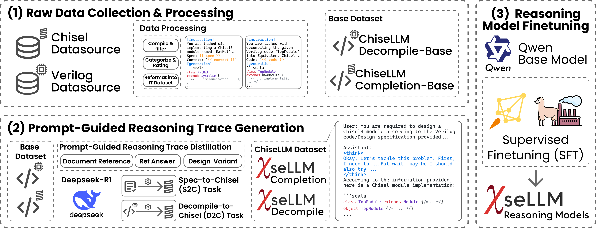

#  : Unleashing the Power of Reasoning LLMs for Chisel Agile Hardware Development

> This Logo is a joke. Do you get it?🤣



ChiseLLM is **a reasoning model optimized for the Chisel language**, designed to enhance agile hardware design capabilities.

- [arxiv](https://arxiv.org/abs/2504.19144)

## Motivation

- The demand for Domain-Specific Architecture (DSA) has driven the development of Agile Hardware Development Methodology (AHDM)
- Chisel, as a Hardware Construction Language (HCL), provides high-level abstraction features, making it ideal for HCL-based agile development
- While Large Language Models (LLMs) excel at code generation, they still face challenges with Chisel code generation, particularly regarding syntax correctness and design variability

## Highlights

- **ChiseLLM Solution**: Comprises data processing and transformation, prompt-guided reasoning trace synthesis, and domain-adapted model training
- **High-Quality Datasets**: Constructed from public RTL code resources and guided to adopt structured thinking patterns through prompt enhancement methods
- **Significant Performance Improvements**:
  - ChiseLLM-7B and ChiseLLM-32B models improved syntax correctness by 18.85% and 26.32% respectively over base models
  - Design variability capability increased by 47.58% compared to baseline reasoning models

## Models and Datasets

- [**ChiseLLM-7B Model**](https://huggingface.co/observerw/ChiseLLM-7B)
- [**ChiseLLM-32B Model**](https://huggingface.co/observerw/ChiseLLM-32B)
- [**ChiseLLM-Completion Dataset**](https://huggingface.co/datasets/observerw/ChiseLLM-Completion)
- [**ChiseLLM-Decompile Dataset**](https://huggingface.co/datasets/observerw/ChiseLLM-Decompile)

Please check [huggingface collections](https://huggingface.co/collections/observerw/chisellm-v10-67fa72af57953fa80bbccc4e) for more information.

## Project Structure

```
chisellm/
├── dataset/                 # Dataset-related code
│   ├── completion/          # Code completion data processing pipeline
│   │   ├── pipeline.py     # distilabel pipeline for completion dataset
│   │   └── templates/       # Code completion prompt templates
│   └── decompile/           # Decompilation data processing pipeline
│       ├── pipeline.py      # distilabel pipeline for decompile dataset
│       └── templates/       # Decompilation prompt templates
├── train_config/            # Training configurations
│   ├── ChiseLLM-7B.yaml     # 7B model training config
│   ├── ChiseLLM-32B.yaml    # 32B model training config
│   └── ds/                  # DeepSpeed configurations
└── utils/                   # Utility functions
```
## Citation

If you are interested in our work, please consider citing this, it would be greatly appreciated!

```bibtex
@misc{wang2025chisellmunleashingpowerreasoning,
      title={ChiseLLM: Unleashing the Power of Reasoning LLMs for Chisel Agile Hardware Development}, 
      author={Bowei Wang and Jiaran Gao and Yelai Feng and Renzhi Chen and Shanshan Li and Lei Wang},
      year={2025},
      eprint={2504.19144},
      archivePrefix={arXiv},
      primaryClass={cs.AI},
      url={https://arxiv.org/abs/2504.19144}, 
}
```
